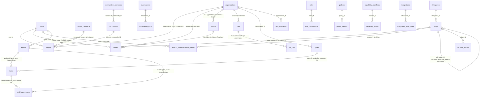

<!-- Updated: 2026-07-21 | Files scanned: packages/core/src/{pipeline,authority,agent-floor,data-scope,automation-executor,goal-task,skill-manifest,child-agent-run,ports}.ts, modules/manifests/src/index.ts, apps/api/src/{router,relationship-help-routing,relationship-materializer,built-in-modules,module-files,server,wiring}.ts, apps/web/src/app/{Layout,routes,pages/HomePage,pages/ModuleDetailPage,pages/SecondBrainPage,dataviews/views/GraphView,components/shared/PanelControl}.tsx, packages/local/src/ports.ts, packages/db/src/{schema,automation-stores,graph-store,helpdesk-store,ledger-store,relation-materialization-store}.ts, packages/db/migrations/0023_vocab4_event_result_file.sql | Token estimate: ~2450 -->

# Load-Bearing Flows + Schema ER

Read this instead of re-reading the pipeline/authority/orchestration source each session. Flow verified 2026-07-17.

## 1. Action pipeline — propose → decide (pipeline.ts, authority.ts)

```mermaid
sequenceDiagram
  participant C as Client (tRPC action.propose)
  participant P as UniversalActionPipeline
  participant A as resolveAuthority
  participant Pol as PolicyEvaluator
  participant M as SkillManifest + GoalTask stores
  participant S as Skill
  participant L as Ledger (append-only)
  C->>P: propose(req) [pipeline.ts:130]
  P->>A: Layer 0 agentFloorDeny → 0.5 planeGate → grants∩scope∪ephemeral−deny (∩principal if onBehalfOf) [authority.ts:380-420]
  A-->>P: allowed? (deny-by-default)
  P->>Pol: evaluate(phase:pre) — block ⇒ reject [152-162]
  alt registered governed Skill
    P->>M: workspace manifest + active Goal/Task + assigned active Agent + authority/Plane/data scope
    M-->>P: resolved or fail closed
  else Human-only kernel passthrough / structurally Agent-floor-denied governance Action
    Note over P: no Agent Skill authority is inferred
  end
  P->>S: skill lookup + agent allowedSkills check, then skill.run() → proposedOutput (NOT committed)
  P->>Pol: evaluate(phase:runtime, proposedOutput) — block ⇒ reject [180-192]
  Note over P: requiresApproval [79-82]: any require_approval policy OR actor is agent ⇒ agents ALWAYS draft
  alt needs approval
    P->>L: append userDecision=null → status pending_review [196-204]
  else human + all-allow
    P->>L: append userDecision="auto" → #commit → applied [207-217]
  end
  C->>P: decide(proposalId, approve|edit|veto, decider) [246]
  Note over P: agentFloorDeny(decider,"approve") ⇒ audited-reject row + 403 [262-278]. Idempotency: already-resolved ⇒ 409 (partial unique idx ledger_ref_ledger_id_resolved_uq) [282-297]
  P->>L: append NEW decision row (never mutate) [303-332]
  alt approve/edit
    P->>P: #commit: Policy(post, advisory) → variance.observe → events.emit("res.action") [370-393]
  else veto
    P->>P: no commit; variance.observe; rejected [334-345]
  end
```

Capability Trust bands (capability/approvals.ts): informational/advisory→auto · transformational→user_pref · operational→governance · **external→explicit_human hard floor**; audience only raises; kill switch ⇒ explicit_human; exhausted auto budgets ⇒ escalate.

## 2. Relationship approval → durable Relation effect

```mermaid
sequenceDiagram
  participant H as Human
  participant A as action.decide
  participant L as Ledger
  participant E as relation_materialization_effects
  participant G as GraphStore
  H->>A: approve/edit Relation proposal
  A->>L: append decision with authoritative ref_ledger_id + DB sequence
  A->>E: create/claim pending effect (proposal+decision unique)
  A->>G: atomically apply winning participant/source Relations
  alt applied
    G-->>E: relation count; mark applied
  else transient failure or lost response
    G-->>E: mark failed/pending + bounded retry metadata
    Note over E: startup/periodic or owner retry replays same decision; no second approval
  end
  Note over G: newest DB decision sequence replaces canonical Relation set and userConfirmed
```

Reads page by `(observed_at, created_at, id)`, deduplicate evidence authorization targets, and
prune inaccessible endpoints/evidence for the authenticated owner. Caller JSON never chooses
proposal linkage; runtime trusts `ref_ledger_id`.

Help Request public token threads, authenticated inbox, capability routing, and governed Offer
drafts live only at `relationship.helpdesk.*`. Routing reads accessible Person Records through
`GraphStore`; tickets remain in the owner/RLS-safe Helpdesk store; Offer drafts use the attributable
Relationship Skill and Action pipeline. No standalone Helpdesk package, top-level API, browser
store, occurrence store, or graph exists.

## 3. Goal/Task Skill + bounded child Agent Run

```mermaid
sequenceDiagram
  participant R as Trusted Agent Runtime
  participant M as SkillManifest + GoalTask stores
  participant C as ChildAgentRunStore
  participant L as Ledger
  R->>M: resolve(workspace, skill, goal, task, assigned Agent)
  M-->>R: active eligible manifest or reject
  R->>C: create(parent envelope, requested child bounds)
  Note over C: intersect authority, Skills, data, budget, review, taint; cap depth; require future deadline
  C->>L: append attributable create audit
  C-->>R: persisted running child
  loop each child Action
    R->>C: validate + atomically reserve call/cost budget
    R->>R: propose through Universal Action Pipeline with child Run context
  end
  R->>C: complete/fail, or Governance/Human cancel
  C->>L: guarded transition + append lifecycle audit
```

Public tRPC exposes inspect/list/cancel only after authentication + workspace membership. Child creation accepts no client-supplied parent ceiling.

## 4. Plane gate crossing (authority.ts; @bridge/local)

```mermaid
sequenceDiagram
  participant LA as Local-plane actor (default plane="local")
  participant G as planeGate (Layer 0.5, before any grant)
  participant CA as Cloud agent
  participant CDB as Cloud canonical (Supabase)
  LA->>G: external:send / external:fetch (EGRESS_RESOURCES)
  G-->>LA: DENY — "local plane may not reach the internet; route a sourcing request to a cloud agent" [72-78]
  LA->>CA: sourcing request (governed)
  CA->>G: any read
  Note over G: cloud plane clamped: requested ∩ "public" — can NEVER read private/local tier [395-397]
  CA->>CDB: writes public/identity-grade facts only (CanonicalIdentityStore)
```

Residency invariant (local/src/ports.ts:1-13): OAuth tokens (SecretStore), raw Gmail/Calendar bodies (BodyStore, structurally private), derived Events/Memories/Signals/warmth (LocalGraphStore) live ONLY local (pglite) — never cross. DataScope lattice (data-scope.ts): all/public/private, intersect = narrowest, public∩private = none ⇒ deny. Separate DB axis: `node_types.plane` mirror|operational|infra + whitelisted cross-plane edge types (SCHEMA.sql:93-107).

## 5. Ritual run (ritual-executor.ts — InProcessRitualExecutor; Hatchet/Temporal deferred behind same interface)

```mermaid
sequenceDiagram
  participant T as Trigger (ritual.run / runById / tool.run)
  participant E as InProcessRitualExecutor
  participant R as Registry (ritual or tool)
  participant P as Pipeline (§1)
  participant Rec as RitualRunRecorder (ritual_runs)
  T->>E: runById(ritualId, params) [95]
  E->>R: load definition; params shallow-merge over step inputs; mint runId [110-126]
  E->>Rec: start(runId,...) [138]
  loop each step, sequentially [141]
    E->>P: propose(step + goalTaskRef, context:{type:"ritual",id,runId}) — same Skill gate as direct Agent work
    alt step rejected
      E->>Rec: finish(halted, haltedAtStep:i) — NO rollback of prior committed steps
    else pending_review
      Note over E: counts as produced (awaits human), not a halt [72-76]
    end
  end
  E->>Rec: finish(completed, steps) [168]
```

## 6. Schema ER sketch (db/src/schema.ts — top slice)



Signal is the `signals` security-invoker view over participant-linked Events, not a table. Timeline is an Event read projection. Tiers: **global/public** = `*_canonical`, `node_types`, `embedding_models` · **local/private** = `people`, `communities`, owner-scoped Relations/effects + Local Plane tokens/bodies/derived data · **operational** = Organization-scoped tables protected by RLS-as-code. Production boot rejects superuser/BYPASSRLS app roles; pglite tests need synthetic non-superuser roles to exercise policies. Governance cluster: roles/permissions/ephemeral grants/delegations/policies + capability manifests/states/trust grants + Goal/Task/SkillManifest/child Run contracts.

## 7. Installation-driven Module shell + full Graph composition

```mermaid
sequenceDiagram
  participant UI as Layout / Module Detail
  participant API as authenticated tRPC
  participant M as ModuleStore
  participant R as AutomationRunRecorder
  participant G as GraphStore
  participant V as shared GraphView
  UI->>API: modules.list / modules.recentRuns(Module)
  Note over UI,M: Built-in identity/routes originate in modules/manifests; API only re-exports
  API->>M: active installed root Modules + manifests
  API->>R: Runs for runtime Automation IDs resolved from active manifest
  UI-->>UI: Skills nested under consuming Agent; no standalone route
  UI->>API: graph.full
  API->>G: permission-pruned Records/Relations/Events/Files
  API->>M: page all installations; keep active installed roots
  API-->>V: graph + Module nodes + manifest Agent nodes + real source paths
  V-->>UI: same node/edge renderer for full and single-Database scopes
```

Left Sidebar/right Chat Panel use one `PanelControl` mode (`collapsed|expanded|extended`), Organization-scoped persisted width/state, shared collapse/extend controls, keyboard resize, narrow overlay controls, and Escape extended→expanded→collapsed.
