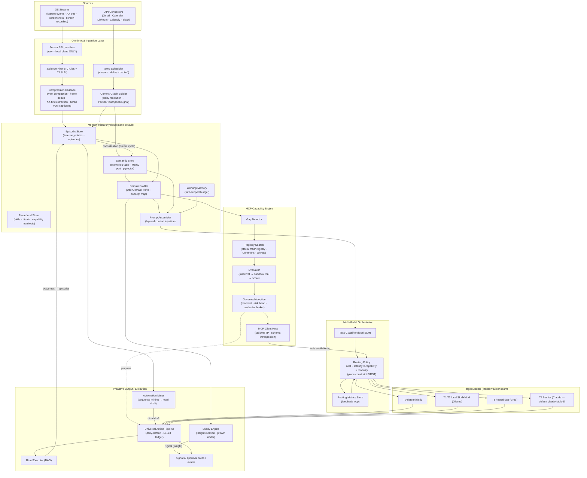

# Brain/Engine Architecture

**Scope**: the cognitive core ("Brain") of the background desktop assistant — memory management, model routing, domain discovery, dynamic context ingestion (connectors + OS streams), autonomous capability expansion (MCP), and execution/automation trigger logic. UI code and raw OS event hooks are out of scope (they live in the Tauri shell / Sensor providers).

**Framing decision (see ADR)**: the Brain is **not a new monolith**. It is the composition of six engines over the *existing* Bridge kernel seams — Unified Graph, Event/Signal Bus, Universal Action Pipeline, Sensor SPI, `ModelProvider`/`createModelRouter`, capability manifests, and the (planned) Mem0-backed Memory port. Everything the Brain proposes flows through the Pipeline (deny-default, draft-then-approve, agent-floor DENY, two-plane gate). The Brain never gets a side-channel.

---

## 0. Coverage audit — already included / partial / missing

The request maps onto Bridge as follows. This is the honest gap list; §2–§7 fill every MISSING row.

```yaml
coverage:
  ingestion_connectors:
    included:
      - Gmail + Google Calendar connectors (built, @bridge/local plane, draft-only egress)
      - SocialProvider framework (X/IG/FB/LinkedIn seam, governed read/write, 42/42 tests)
      - Connector FACTORY: APIs.guru CC0 OpenAPI → OpenAPI Generator → typed client → manifest → risk band
      - Credential broker concept (tools never hold OAuth; scoped/revocable/audited grants)
      - Gated intake: quarantine → Pipeline proposal → commit (capture ≠ commit)
    partial:
      - Credential broker INTERNALS (rotation/scoping/revocation) — named gap #7, undefined
    missing:
      - Continuous sync scheduler (cursor/delta management, backoff, per-connector cadence)
      - Semantic communications-graph builder (entity resolution email↔calendar↔social → Person/Touchpoint)
  ingestion_os_visual:
    included:
      - Sensor SPI / context-provider registry (9 kinds; raw/derived split AT TYPE LEVEL)
      - Raw payloads local-plane ONLY; consumers see ContextObservation; cloud read refused
      - CaptureLedger → Memory entry per capture; blink tell; kernel runs with ZERO providers
      - apps + clipboard providers live; screen = stub; AX-first doctrine (desktop-companion)
    missing:
      - The COMPRESSION CASCADE: salience filter → event compaction → frame dedup → tiered
        summarization → retention/aging (nothing exists between raw capture and Memory)
      - Screen-recording / periodic-screenshot processing pipeline (keyframing, VLM captioning tiers)
  model_router:
    included:
      - ModelProvider port (zero-dep) + Ollama/Anthropic/Groq/Echo providers
      - createModelRouter(bindings): plane rules (local-default NEVER falls to cloud; cloud may fall local)
      - Tiers reasoning/default/cheap per workspace; 5-tier capability ramp T0–T4 (companion doc)
    missing:
      - Dynamic routing POLICY: cost/latency/capability/modality scoring, task classification,
        routing-metrics feedback loop, hedging/fallback, budget enforcement
  mcp_capability_expansion:
    included:
      - capability_manifests + computed risk + trust bands + lethal-trifecta rule
      - On-the-fly tools: OpenAPI/doc ingest → capability DEFINITION → register + permission before run
      - Package runtime (parse/risk-union/single-live-version/rollback-as-fork); Commons registry v1
      - ≤20 active tools per agent turn, deferred registry lookup beyond
      - Supply-chain stance: signing/provenance FIRST (oss-commons)
    missing:
      - An actual MCP CLIENT HOST in the runtime (stdio/HTTP transports, tool schema introspection)
      - Gap detector → registry search → evaluation → sandbox trial → governed adoption loop
      - EMA/token boundary handling for third-party MCP servers (credential broker extension)
  memory_hierarchy:
    included:
      - timeline_entries (append-only); pgvector; two-plane residency; Mem0 planned behind port
      - Verdict from undefined-elements #3: thin `memories` table, authority-scoped retrieval,
        pglite default, don't fork timeline_entries
      - PromptAssembler NAMED (ADR-026)
    missing:
      - Working-memory manager (turn-scoped context budget)
      - Consolidation ("dream cycle" named, never spec'd): episodic → semantic promotion, decay,
        contradiction handling
      - PromptAssembler LAYERING MODEL (gap #6)
  domain_discovery_growth:
    included:
      - Onboarding 5–12 adaptive Qs → blueprint; Learning Agent (never executes); live
        competitor discovery principle (no hardcoded knowledge)
      - Knowledge/RAG unlock gate exists (2+ sources)
    missing:
      - UserDomainProfile schema + evidence accumulation (gap #11 adjacent)
      - Concept-map builder; proactive insight curation subsystem ("Buddy"); co-evolution ladder
      - Knowledge/RAG engine itself (gap #12)
  automation_identifier:
    included:
      - Ritual planner/executor split (swarm plans, DAG runs); L0–L3 approvals; two-gate promotion
        (quality + trigger P/R); variance adjuster; promotion ladder as compiler rules (P3)
      - "Pattern engine over sensors+activity" NAMED in P3
    missing:
      - The pattern engine itself: event canonicalization, sequence mining, candidate scoring,
        synthesis → ritual DAG draft
```

**Bottom line**: Bridge already owns the *governance chassis* and the *seams*. The Brain work = six missing engines: (1) Compression Cascade, (2) Sync Scheduler + Comms-Graph Builder, (3) Routing Policy Engine, (4) MCP Host + Discovery Loop, (5) Memory Consolidator + PromptAssembler layering + Domain Profiler/Buddy, (6) Automation Miner.

---

## 1. System architecture diagram



Invariants preserved: raw capture never crosses the local plane; every mutation goes through the Pipeline; the Brain's proactive outputs are always **Signals or governed proposals**, never direct acts; agent-floor DENY and lethal-trifecta escalation apply to Brain-initiated actions identically.

---

## 2. Omnimodal Ingestion Layer

### 2.1 Connector framework (what to build on top of the factory)

The connector *factory* exists (OpenAPI spec → typed client → manifest → risk band). Missing pieces:

**Sync Scheduler** (`@bridge/ingest`, new package):
- Per-connector `SyncPlan`: `{ connector_id, mode: webhook|poll|delta, cadence_s, cursor, backoff_state, budget }`. Gmail/Slack = delta+webhook where available; Calendly/LinkedIn = poll with etag/updated-since cursors.
- Cursor persistence in the local store (pglite) — sync state is user data, never Commons/cloud control plane.
- Adaptive cadence: activity-weighted (a connector whose deltas are always empty decays toward its floor cadence; a bursty one tightens). Pure function over recent delta counts — no model call.
- All fetches run as **cloud-plane sourcing agents through the gate** (existing local↔gate↔cloud doctrine); results dual-write per the residency rule (identity/contact → global+local; content → local only).

**Comms-Graph Builder**:
- Normalizes each fetched item to a `RawCommsItem` → entity resolution → graph writes as *proposals* (Person / Touchpoint / Memory / Signal), reusing the Recon match-tier policy (strong = name+1 corroborating point auto; moderate = pending; ambiguous = `possible_duplicate` Signal — never auto-merge).
- Edges land on the Mirror plane (Person/Community) + Operational plane (Touchpoint), respecting the cross-plane whitelist.
- Embedding pass (pinned canonical dim) on Touchpoint summaries → pgvector, enabling "semantic graph of communications and scheduling" retrieval.

### 2.2 OS & visual stream pipeline — the Compression Cascade

Problem: raw OS data is ~10⁴–10⁶ events/day + screen frames; naive storage blows local disk and no context window can hold it. Design principle: **compress at capture time, summarize at rest, age out aggressively; AX-first, pixels last**.

Stages (all local-plane; T0–T2 models only by default — capture plane never falls to cloud):

1. **Salience Filter** (T0 rules, <1 ms/event): drop keystroke-level noise, dedupe repeated focus events, coalesce scroll storms. Configurable denylist (password fields, incognito, user-flagged apps) enforced *before* anything is written. Output ≈ 1–5 % of raw volume.
2. **Event compaction**: sliding 30–120 s windows → `ActivitySpan { app, window_title_hash, ax_context, duration, interaction_class }`. Spans, not events, are what persists. ~500–2 000 spans/day.
3. **Visual capture, AX-first**: screenshots taken only on triggers (app switch after dwell, explicit user ask, ritual step needing vision) — never on a blind timer by default. For each trigger: try AX-tree extraction first (deterministic text + geometry, no model). Only if AX is insufficient → single frame.
4. **Frame dedup + keyframing**: perceptual hash (pHash) against last-N frames per window; recording sessions reduce to keyframes on ≥ threshold visual delta. Frames stored in `LocalMediaStore` (bytea, append-only, archive-not-delete).
5. **Tiered captioning**: T2 on-device VLM (Moondream2/SmolVLM class) produces a structured caption `{ app_context, visible_entities[], user_action_guess, text_excerpts[] }` per keyframe. T4 (frontier VLM) only on explicit user request or an approved External-band ritual step — a cloud VLM reading your screen is an egress grant, full stop.
6. **Hierarchical summarization (summarize at rest)**: spans+captions → hourly digest (T1 SLM) → daily digest → weekly digest. Each level embeds into pgvector; each level links down to its sources (episode → spans → media ids).
7. **Retention/aging policy** (`policy_params`, user-tunable, governed):
   - raw frames: 72 h default, then archived-out unless referenced by a Memory/episode;
   - ActivitySpans: 30 d;
   - hourly digests: 90 d;
   - daily/weekly digests + promoted Memories: indefinite.
   Aging = `archived_at`, honoring no-hard-delete; a compaction ritual reclaims blob space from archived frames (the one sanctioned physical delete, itself a governed ritual with ledger entry).

Context-window discipline: the Brain never injects spans or frames into prompts. Retrieval targets the digest/Memory tier; drill-down to a specific frame happens only inside a tool call scoped to that question.

Every capture still emits the `sensor.capture` event (blink tell) and an inspectable CaptureLedger row — the cascade compresses *content*, never *accountability*.

---

## 3. Multi-Model Orchestrator (Routing Policy Engine)

`createModelRouter` today resolves static bindings + plane rules. The Brain adds a **policy layer above it** — the plane rule stays the hard outer constraint (local-default binding NEVER falls to cloud).

### 3.1 Decision order (strict)

1. **Plane constraint** (existing, non-negotiable): capture/sensor tasks → local providers only.
2. **Modality filter**: task needs vision → VLM-capable providers only; needs tools → tool-calling providers.
3. **Capability floor**: task class → minimum tier (from the capability matrix below).
4. **Score remaining candidates**: `score = w_q·qualitŷ − w_c·cost̂ − w_l·latencŷ` with per-task-class weights (interactive UI answer: latency-heavy; nightly consolidation: cost-heavy; External-band drafting: quality-heavy).
5. **Budget check**: workspace + per-agent token/$ budgets (ties into trust_grants budget tables, long-tail gap); over budget → degrade to lower tier + emit Signal, never silently exceed.

### 3.2 Task classification

A local T1 SLM (structured-output, ~10–30 ms on Ollama) classifies each `TaskEnvelope` into one of a closed task-class enum: `{event_classify, caption_frame, summarize_digest, extract_entities, draft_comms, plan_ritual, deep_reasoning, code_gen, screen_qa, embed}` — with a deterministic keyword fallback (same pattern as `classifyIntent` in chief-of-staff.ts). Classification confidence < τ → route one tier up rather than misroute.

### 3.3 Learning loop — heuristics first, bandit later

- **v1 (ship first)**: static capability matrix (task_class × tier → allowed/preferred), hand-set weights in `policy_params`. Every dispatch writes a `routing_metrics` row (schema §7.3): tokens, $, latency, outcome grade.
- **v2**: outcome grades come free from the existing eval machinery — approval/veto/edit on the downstream proposal is a natural label ("edited heavily" = quality miss; timeout = latency miss). Per-(task_class, provider) running quality estimate → contextual ε-greedy bandit *within the allowed set only*. The bandit tunes preference order; it can never override plane, modality, floor, or budget. Router changes are `policy_params` diffs through the Pipeline (veto tunes params, not code).
- **Hedging/fallback**: provider error/timeout → next candidate in scored order; interactive tasks may race local-vs-hosted and take first token (hedge only when both candidates are same-plane).

Model names are **config, not code**: the matrix references tiers (T0–T4) and provider ids, so "Claude for deep work, a hosted fast model for triage, local SLM/VLM for capture" is a default binding set, not a hardcoded assumption. (The prompt's "Claude 3.5 Sonnet / GPT-4o" examples are already-stale model ids — exactly why the seam stays name-agnostic.)

---

## 4. Autonomous Capability Expansion — MCP Capability Engine

### 4.1 What exists to reuse

Capability manifests + computed risk + trust bands + gated intake + package runtime + Commons + the on-the-fly-tools rule ("a capability *definition* that must be registered + permissioned before any run"). An MCP server is *just another capability origin* — it slots into this machinery; it does not get its own governance path.

### 4.2 MCP Client Host (`@bridge/mcp-host`, new package)

- Transports: stdio (local servers, spawned as sandboxed child processes) + streamable HTTP (remote).
- On connect: introspect tools/resources/prompts → generate a `capability_manifest` per tool (name, input schema, resource types touched, egress classification). Manifest is *derived*, then human-reviewed — a server's self-description is untrusted input.
- Runtime enforcement: every MCP tool call goes agent → Pipeline → broker → tool (capability broker rule; never agent→tool direct). Tool *outputs* are tainted third-party content — they enter prompts through the same quarantine posture as web content (prompt-injection defense; runtime-taint gap from the security audit applies here and is a prerequisite for high autonomy).
- ≤20-tools rule respected: connected servers register into the deferred lookup registry; only task-relevant tools are surfaced per turn.

### 4.3 Discovery loop: Gap → Search → Evaluate → Adopt

**Gap Detector** (runs inside the Learning Agent — observes, never executes):
- Signals of a gap: (a) task failures with "no capable tool" cause; (b) DomainProfile drift — new recurring entities/technologies in the concept map (e.g. `aws`, `postgres` clusters appearing across ActivitySpans and comms) with no matching installed capability; (c) explicit user ask.
- Emits `capability_gap` Signal: `{ domain_terms[], evidence_episode_ids[], attempted_tasks[], confidence }`.

**Registry Search** (cloud-plane sourcing through the gate):
- Order: **Universal Commons first** (curated, signed) → official MCP registry → GitHub search (`topic:mcp-server` + domain terms). Query grammar = domain terms from the gap Signal + task verbs; this doubles as the answer to the "competitor-discovery query grammar" gap — same engine, different corpus.
- Candidate metadata scored *statically first*: license (AGPL/SSPL/BUSL auto-reject per oss policy), maintenance recency, stars/adoption, declared auth model, provenance/signature if present.

**Evaluator**:
1. **Static vet**: manifest diff vs declared behavior; dependency scan; license gate; pinned version + checksum (supply-chain signing/provenance FIRST, per oss-commons).
2. **Sandbox trial**: spin server under `SandboxProvider` (E2B/Daytona later; local isolated process now) with **no credentials, no network egress** unless the trial explicitly requires it (then synthetic/read-only creds). Run a generated probe suite: schema-conformance calls + 3–5 task-shaped evals from the gap's attempted_tasks. Score: correctness, latency, schema stability.
3. Trial results + static vet → `mcp_candidate` record with a computed risk band (trifecta rule applies: a server that reads private data AND has egress = External band, human-approved, always).

**Governed Adoption**:
- Approval card: what it is, why proposed (evidence episodes), computed risk, exact tool list, credential scopes requested. Install = capability package install through the existing `packages.*` flow (single-live-version, rollback-as-fork).
- **Nothing auto-installs.** The autonomy is in *finding and vetting*; adoption is L2+ (propose→approve) minimum, External band for anything with egress or broad scopes. Trust can raise later per the trust-decay model (earn autonomy, decay without use).

### 4.4 EMA / token boundaries (credential broker extension — fills gap #7)

- MCP servers **never see raw tokens**. The credential broker holds OAuth/API creds in the local-plane vault; a tool call executes through a broker proxy that injects credentials at the egress edge and strips them from anything written back.
- Grants are `{ credential_id, capability_id, scope_subset, expires_at, budget }` — per-capability, least-scope, ephemeral by default (ritual-run-minted grants lapse, matching the existing ephemeral-grant layer).
- Enterprise-managed auth: broker delegates to the org IdP (OAuth 2.1 + token exchange RFC 8693 where supported) so org policy owns issuance; Bridge only ever holds narrow, exchanged, expiring tokens. Revocation = revoke grant row → broker refuses injection immediately; rotation is broker-internal, invisible to capabilities.
- Every injection is ledgered (`credential_use` entries) — auditable per-call, per-capability.

---

## 5. Blank Slate & Memory Hierarchy

Four tiers, all behind ports, local-plane default (pglite + pgvector), consistent with the undefined-elements #3 verdict (thin `memories` table; don't fork `timeline_entries`; authority-scoped retrieval at the store boundary; Mem0 = optional adapter).

```yaml
memory_tiers:
  working:    # turn-scoped, in-process
    what: current task envelope, retrieved snippets, tool results
    store: none (assembled per prompt by PromptAssembler under a token budget)
  episodic:   # what happened
    what: ActivitySpans, digests, ritual-run snapshots, routing outcomes, approvals/vetoes
    store: timeline_entries (append-only) + episodes rollups; embeds per level
  semantic:   # what is durably true
    what: confirmed facts, preferences, entity knowledge, domain concepts
    store: memories table (status confirmed|superseded; provenance links to episodes); Mem0 port
  procedural: # how to act
    what: skills, rituals, capability manifests, learned automations
    store: existing registries (no new store)
```

**Cold-start ("blank slate") ladder** — the Brain never fakes knowledge it lacks (no-dummy-data rule):
Day 0: onboarding answers → seed semantic memories + a low-confidence DomainProfile. Hours: connector backfill → comms graph → entity memories. Days: sensor digests → work-pattern memories → profile confidence rises → unlock gates trip (Knowledge at 2+ sources, per onboarding flow). Weeks: consolidation + Buddy + Automation Miner activate (both require minimum evidence floors — see §6, §7).

**Consolidation — the dream cycle, made concrete** (fills the "named, never spec'd" gap): a nightly L1 ritual (act+notify), local models only:
1. Cluster yesterday's episodes (embedding + entity overlap).
2. Extract candidate facts/preferences (T1/T2 extraction with structured output).
3. Reconcile against existing memories: corroborate (confidence ↑) · contradict (propose `superseded`, keep both + provenance — never destructive) · novel (insert `candidate`).
4. Candidates promote to `confirmed` on corroboration threshold OR explicit user confirmation; user-stated facts skip straight to confirmed.
5. Decay: memories carry `last_corroborated_at`; retrieval weight decays with staleness (retrieval-rank decay, not deletion). Feeds the DomainProfiler (§6).

**Retrieval & injection — PromptAssembler layering model** (fills gap #6). Fixed layer order, per-layer token budgets, deny-default at the store boundary (an agent's authority scope filters *before* ranking — private-tier memories never reach an unauthorized assembly):

```
L0 identity/persona     (spirit-animal/CoS profile — small, stable, cacheable)
L1 governance preamble  (authority scope, band, taint warnings — non-negotiable)
L2 task envelope        (the actual request + tool schemas for THIS turn, ≤20 tools)
L3 semantic memories    (top-k hybrid: pgvector cosine + pg_trgm keyword + graph-adjacency boost
                         + recency/decay weight; k small, snippets not documents)
L4 episodic context     (digest-tier only; drill-down via tools, never inline)
L5 domain frame         (relevant DomainProfile concept slice)
```
Overflow policy: truncate L4 → L3 tail → compress L5; L0–L2 never truncate. Every assembled prompt records its `memory_used[]` ids into the execution snapshot (already required by the replay contract).

---

## 6. Dynamic Domain Discovery & Proactive Growth (Buddy Engine)

### 6.1 UserDomainProfile (schema §7.1)

A living, *evidence-backed* model of what the user does — built from onboarding seeds + comms graph + activity digests, refined by the dream cycle. Core = a **concept map**: nodes (skills/tools/topics/entity-types) with confidence + evidence links, edges (co-occurrence, dependency). Distinguishing "investor vs software engineer" is emergent: the profile is a distribution over observed concepts/verbs/artifacts (term-frequency over spans+comms, embedded and clustered), not a picklist of professions. Nothing hardcoded — the concept vocabulary grows from evidence, honoring the "no hardcoded external knowledge" invariant.

Profile updates are **governed**: the dream cycle proposes profile diffs; minor diffs auto-approve via the Governance Agent (dual-axis minor), role/domain shifts = approval card ("Looks like AWS architecture has become a big part of your week — treat it as a working domain?"). The user can always inspect + edit the profile — it's their model of themselves.

### 6.2 Proactive assistance (curation)

Runs in the Learning Agent (observe/research only, never executes):
- **Inputs**: profile concept slice + staleness scores; live research through governed egress (the same registry-search engine as §4.3, pointed at content: docs, releases, industry sources; NeoCognition-style competitor-watch items ride this too).
- **Curation filter**: relevance (profile match) × novelty (not already in semantic memory) × actionability (maps to a capability or skill the user could adopt). Threshold-gated; budgeted (max N insights/week — attention is the scarce resource).
- **Output**: `insight` Signals — and every Signal carries an action (existing invariant): "read this" is weak; "want me to draft X / install Y / build Z workflow?" is the bar.
- Feedback: dismiss/act on insight Signals = labels; curation thresholds live in `policy_params` and tune via the Variance Adjuster (bounded single-param nudges).

### 6.3 Co-evolutionary loop

`complexity_stage` per concept cluster (novice → operating → fluent → advanced), inferred from evidence: vocabulary sophistication in the user's own artifacts, task types attempted, tools adopted, error/lookup rates. Stage gates *presentation depth*: suggestion verbosity, whether the Brain explains or just does, which tier of insight is surfaced, how ambitious Automation Miner proposals get. Stage transitions are profile diffs → governed like any other. This is the mechanism behind "autonomy ramps down from 100 % review" — as stage + trust rise, the Governance band and the explanation depth relax together, never independently.

---

## 7. The Automation Identifier (Automation Miner)

### 7.1 Pattern detection

- **Canonical event alphabet**: ActivitySpans + comms events + in-Bridge actions map to canonical tokens `verb(app_class, object_type)` — e.g. `open(spreadsheet, report)`, `copy(browser, table)`, `paste(spreadsheet, table)`, `send(email, weekly_report)`. Canonicalization is T0/T1 (rules + SLM assist) — deterministic enough that identical work produces identical strings.
- **Sequence mining**: closed sequential-pattern mining (PrefixSpan-family) over per-day token streams with gap tolerance; plus a periodicity detector (same subsequence recurring daily/weekly/on-calendar-event). Pure algorithm on the local plane — zero model tokens for detection, matching the ladder-audit invariant (threshold checks = pure fn, never model calls).
- **Candidate scoring**: `support (count) × regularity (period stability) × duration (time it costs the user) × automatability (all steps map to installed capabilities?) − risk (egress/private-data steps)`. Thresholds in `policy_params` (default: ≥3 occurrences over ≥2 weeks + every step capability-mappable).

### 7.2 Synthesis & flagging

1. Candidate → ritual **Planner** (the existing agentic planner): synthesize a proposed DAG whose nodes are *existing registered capabilities only*. Unmappable step → that's a `capability_gap` Signal into §4's loop instead of a brittle screen-scripting hack.
2. Draft ritual = a governed proposal with the evidence attached: "You've done this 7 times, ~12 min each — here's a workflow" + step-by-step dry-run preview (dry-run + per-step approval gates = existing P3 SHIP item).
3. Adoption path rides the trust ladder: starts L2 (propose→approve each run) → user may promote toward L1/L0 per the two-gate promotion rule (output quality AND trigger precision/recall measured independently — a workflow that fires at the wrong time fails gate 2 even if its output is perfect). Egress/agent-floor steps pinned ≥L2 forever.
4. Every run writes outcome episodes → trigger P/R and quality stats accumulate → promotion/demotion via the existing eval harness. Rejected candidates are remembered (suppress re-proposal for M days; repeated rejection = negative preference memory).

---

## 8. Data schemas

### 8.1 UserDomainProfile

```jsonc
{
  "profile_id": "ulid",
  "workspace_id": "ulid",
  "version": 14,                      // immutable versions, diffable (change-mgmt rule)
  "updated_at": "2026-07-09T03:10:00Z",
  "confidence": 0.71,                 // global evidence-mass score
  "identity_seed": {                  // onboarding answers, user-editable, wins over inference
    "self_described_role": "founder / product engineer",
    "stated_goals": ["ship Bridge P0", "raise awareness"]
  },
  "concepts": [
    {
      "concept_id": "ulid",
      "label": "aws-architecture",
      "kind": "technology",           // technology | practice | topic | artifact_type | entity_type
      "embedding_ref": "vec:...",     // pinned canonical dim
      "confidence": 0.82,
      "complexity_stage": "operating",// novice|operating|fluent|advanced
      "evidence": [ {"type": "episode", "id": "ulid", "weight": 0.4},
                    {"type": "memory",  "id": "ulid", "weight": 0.6} ],
      "first_seen": "2026-06-30", "last_corroborated": "2026-07-08",
      "linked_capabilities": ["cap_ulid"],
      "gap_state": "none"             // none | gap_signalled | capability_proposed | covered
    }
  ],
  "edges": [ {"from": "concept_a", "to": "concept_b", "rel": "co_occurs", "weight": 0.55} ],
  "rhythms": [                        // temporal dynamics for Buddy + Miner
    {"pattern": "weekly_report", "period": "P1W", "anchor": "friday_pm", "stability": 0.9}
  ],
  "curation_prefs": {"max_insights_per_week": 5, "muted_concepts": ["crypto"]}
}
```

### 8.2 Episodic learning log (episode rollup over `timeline_entries`)

```jsonc
{
  "episode_id": "ulid",
  "plane": "local",
  "level": "hourly",                  // span | hourly | daily | weekly
  "t_start": "...", "t_end": "...",
  "summary": "Debugged Drizzle migration; 3 test runs; emailed J. re: pilot.",
  "embedding_ref": "vec:...",
  "source_refs": ["span_ulid", "media_ulid", "touchpoint_ulid"],   // drill-down links
  "entities": ["person_ulid", "concept:drizzle"],
  "canonical_tokens": ["edit(ide,migration)", "run(terminal,tests)", "send(email,update)"],
  "outcome": {"kind": "ritual_run", "ritual_id": "ulid", "grade": "approved_unedited"}, // nullable
  "consolidation_state": "pending"    // pending | consolidated | archived
}
```

### 8.3 Routing metrics

```jsonc
{
  "route_id": "ulid",
  "task_class": "summarize_digest",
  "plane": "local",
  "candidates_considered": ["ollama:llama3.2-3b", "groq:llama-3.3-70b"],
  "chosen": "ollama:llama3.2-3b",
  "policy_version": 7,
  "constraint_trace": {"plane": "pass", "modality": "pass", "floor": "T1", "budget": "pass"},
  "tokens": {"in": 1840, "out": 210}, "cost_usd": 0.0, "latency_ms": 620,
  "outcome": {"grade": "accepted", "signal": "approval_unedited",  // veto|edited|timeout|error
              "downstream_proposal_id": "ulid"},
  "ts": "..."
}
```

### 8.4 MCP integration record

```jsonc
{
  "mcp_id": "ulid",
  "origin": {"registry": "commons|official|github", "url": "...", "pinned_version": "1.4.2",
             "checksum": "sha256:...", "license": "MIT", "signature_verified": true},
  "transport": "stdio",
  "derived_manifests": ["cap_ulid"],           // one capability_manifest per exposed tool
  "risk_band": "external",                     // computed; trifecta rule applied
  "trial": {"probe_pass_rate": 0.95, "latency_p50_ms": 240, "schema_stable": true},
  "credential_grants": [{"grant_id": "ulid", "scope_subset": ["s3:read"], "expires_at": "..."}],
  "state": "candidate|approved|active|suspended|rolled_back",
  "trust": {"score": 0.4, "last_used": "...", "decay_policy": "standard"}
}
```

---

## 9. Implementation roadmap (Phase 1–5, mapped onto Bridge P0–P3)

Each phase = one hypothesis, testable, bootstrappable from blank state. Test doctrine throughout: ports get conformance suites (existing pattern — in-memory adapter first, real adapter binds same suite); mining/routing thresholds get replayable fixture streams; anything model-touched gets an eval set before promotion (two-gate rule).

**Phase 1 — Ingest & Remember (Bridge P0)** · *hypothesis: the Brain can build honest memory from real streams.*
Build: Sync Scheduler + cursor store · Comms-Graph Builder (Gmail/Calendar first — already connected) · Salience Filter + event compaction + ActivitySpans · `memories` table + episodic rollups + embedding pass · PromptAssembler v1 (layer order + budgets, no fancy ranking).
Test: golden fixture streams (recorded real sessions, PII-scrubbed) → deterministic span/digest output; retrieval precision spot-checks; residency conformance (raw never on consumer API — type-level test exists, extend to cascade outputs).
Exit: cold-start ladder works — connect Gmail, one day of desktop use → inspectable digests + memories, all via CaptureLedger.

**Phase 2 — Route & Compress (P0 tail)** · *hypothesis: right model, right cost, screen data stays cheap.*
Build: Task Classifier (T1 + keyword fallback) · Routing Policy v1 (static matrix, weights in `policy_params`) · `routing_metrics` · frame dedup + AX-first extraction + T2 captioning + retention/aging ritual.
Test: routing conformance table (task_class × constraints → expected provider) as pure-fn tests; storage-budget soak test (7-day synthetic capture ≤ disk envelope); caption eval set (AX-answerable questions must NOT invoke the VLM).
Exit: a week of ambient capture fits the local budget; every dispatch has a constraint trace.

**Phase 3 — Understand & Curate (P1–P2)** · *hypothesis: the Brain knows what you do without being told.*
Build: dream-cycle consolidation ritual · DomainProfiler + concept map + governed profile diffs · Buddy curation v1 (budgeted insight Signals w/ actions) · complexity_stage inference v1.
Test: profile-accuracy panel (user grades top-10 concepts — target ≥8/10 "yes that's my work"); consolidation contradiction fixtures (supersede-never-delete verified); curation precision (acted-on / surfaced ≥ threshold before widening budget).
Exit: two-week-old workspace produces a profile the user endorses + ≥1 insight/week they act on.

**Phase 4 — Expand (P2–P3)** · *hypothesis: the Brain can safely grow its own hands.*
Build: `@bridge/mcp-host` (stdio first) · manifest derivation from introspection · Gap Detector · registry search (Commons → official → GitHub) · static vet + sandbox trial harness · credential-broker grant extension (scope subset, expiry, injection proxy, ledgered use) · governed adoption cards.
Test: adversarial MCP fixture servers (over-broad scopes, schema drift, prompt-injection payloads in tool output) must be caught at vet/taint stage; end-to-end: seeded "user starts AWS work" fixture stream → gap Signal → AWS-MCP candidate → approval card with correct External band.
Exit: one real third-party MCP server discovered, vetted, approved, and used in a governed run — with zero raw-token exposure.

**Phase 5 — Automate & Co-evolve (P3)** · *hypothesis: the Brain gives time back.*
Build: canonical event alphabet + PrefixSpan miner + periodicity detector · candidate scoring + suppression memory · Planner synthesis to ritual drafts + dry-run preview · trigger-P/R accounting into the two-gate promotion · routing bandit v2 · stage-gated suggestion depth (co-evolution).
Test: replayed synthetic streams with planted patterns (known support/period) → detection P/R benchmarks; false-positive budget (<1 spurious proposal/week on pattern-free streams); promotion-gate simulation (a perfect-output/wrong-trigger workflow must fail gate 2).
Exit: ≥1 mined automation adopted and re-run by a real user, with measured minutes saved on the ledger.

---

## 10. Trade-offs & open questions

- **AX-first vs pixels-first**: chosen AX-first (deterministic, cheap, private) at the cost of coverage on non-AX apps (games, some Electron). Fallback = triggered frames + T2 VLM. Revisit if AX coverage in the user's real app mix < ~70 %.
- **Mining = pure algorithm, not LLM**: cheaper, replayable, threshold-auditable; misses fuzzy semantic repetition ("weekly report" done three different ways). Mitigation: canonicalization uses T1 SLM assist; full LLM-over-episodes pattern proposals = possible v2, must still pass the same scoring gates.
- **Bandit scope**: deliberately clamped inside constraint-filtered candidates. Full learned routing (predicting quality from prompt features) deferred — needs volume the single-user phase won't have.
- **MCP trust ceiling**: even vetted servers start Draft/low-trust; the real long-pole is the **runtime taint gap** flagged in the security audit — high-autonomy MCP use should wait on taint tracking, not just band labels.
- **Profile privacy**: UserDomainProfile is arguably the most sensitive artifact Bridge will hold. Local-plane only; never Commons-minable even in generalized form without a separate explicit review (generalization leaks are real).
- **Open**: embedding dim pin (existing schema-v2 punch-list item) blocks the cascade's embed pass; onboarding-profile → CoS system-prompt seam (gap #11) should be built as PromptAssembler L0 rather than a bespoke path; whether `episodes` is a new table or a `timeline_entries` view + rollup table needs a schema-v2 decision.
