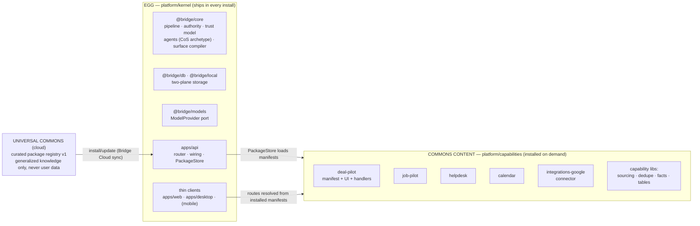

# Repo Restructure Plan — make the egg/Commons boundary physical

## Problem (audit findings, 2026-07-11)

The egg (minimal kernel) is **defined in docs** ([wiki/module-evolution.md](../wiki/module-evolution.md):
actors + capability execution engine + work pipeline + surface compiler + Memory/Knowledge +
CoS archetype + ports + Trust Model; everything else = Commons content) but the repo does **not**
reflect that boundary:

1. **No physical egg/Commons split.** Commons-content capabilities (DealPilot, JobPilot,
   Helpdesk, Calendar) are hardcoded in `platform/apps/api/src/built-in-packages.ts` and their
   UI pages live inside `platform/apps/web/src/app/pages/` interleaved with kernel pages
   (Approvals, Settings, ControlPanel…). `platform/packages/` mixes kernel packages
   (`core`, `db`, `models`, `local`) with capability-content packages
   (`sourcing`, `dedupe`, `facts`, `tables`, `integrations-google`).
2. **Duplicate/stale copies at repo root.** `Design Bridge AI Interface (Copy)/` (14 MB) is the
   old prototype — confirmed STALE vs the deployed reference (bridge-ai-1ay.pages.dev,
   2026-07-10); its designs are already ported into `platform/apps/web` (~20 files carry
   "ported from the prototype" provenance comments). It also contains real LinkedIn PII.
   `Tools/` (15 MB) holds three standalone apps (recon, hni, card-scanner) with their own
   package.json outside the pnpm workspace. Root also has loose one-off docs
   (`All fixes.md`, `BRIDGE_PLAN_CRITIQUE_AND_EXTENDED_PLAN.md`, `BRIDGE_PLATFORM_RESET_HANDOFF.md`).
3. **No egg↔Commons architecture diagram.** `docs/CODEMAPS/architecture.md` (2026-07-04)
   predates the egg framing and still describes the prototype as a live coexisting codebase.

## Target diagram (to land in CODEMAPS/architecture.md)

Connection rule: kernel never imports from `capabilities/`; capabilities import kernel ports
only (`@bridge/core`, `@bridge/tool-kit`). Enforced by ESLint boundary rule (same pattern as
`bridge/no-crm-vocab`).

## Phases

### Phase 1 — kill duplicates (cheap, immediate)
- Archive `Design Bridge AI Interface (Copy)/` out of the working tree: move to an
  `archive/prototype` branch (or separate private repo), delete from main. **Caveats needing
  user sign-off**: (a) it contains real PII — history scrub question already tracked;
  (b) it is the wrangler deploy SOURCE for bridge-ai-1ay.pages.dev — archiving freezes that
  deploy path; reference site stays live but un-redeployable from main. → APPROVALS row.
- Root loose docs (`All fixes.md`, `BRIDGE_PLAN_CRITIQUE_AND_EXTENDED_PLAN.md`,
  `BRIDGE_PLATFORM_RESET_HANDOFF.md`) → `docs/raw/` with frontmatter.
- `Tools/` → declare status per app: `recon` = active (platform-direction per memo) → migrate
  into `platform/tools/recon` in Phase 3; `hni`, `card-scanner` = dormant → same archive branch.

### Phase 2 — draw the egg boundary inside platform/
- New top-level `platform/capabilities/` workspace dir. Move, one capability at a time
  (calendar first — smallest): manifest (from built-in-packages.ts) + UI pages/components +
  data modules + server handlers into `capabilities/<name>/`.
- `built-in-packages.ts` shrinks to a loader that imports each capability's `manifest.ts` —
  single source of truth per capability, no hardcoded duplicate list.
- `apps/web` route table resolves capability routes from installed manifests (already close:
  `moduleRoutes.ts` + `PACKAGE_ROUTES` today — collapse these two parallel maps into the
  manifest as part of the move).
- Reclassify `platform/packages/`: kernel keeps `core db local models tool-kit sensors`;
  `sourcing dedupe facts tables integrations-google` move to `platform/capabilities/lib/`
  (or stay put with a `"plane": "commons"` marker in package.json — decide at execution;
  physical move preferred per "no confusion" requirement).
- Add ESLint boundary rule: kernel paths may not import `capabilities/**`.

### Phase 3 — converge tools
- `platform/tools/*` (deal-pilot, job-pilot, sourcing tools, recorder) fold into their
  matching `capabilities/<name>/` so each capability is ONE directory (manifest + UI +
  engine), not three scattered ones. Migrate `Tools/recon` in as `capabilities/recon`.

### Verification per phase
`pnpm turbo run build` + `@bridge/core` tests green; web routes smoke-tested in Browser pane;
CODEMAPS regenerated (update-codemaps skill) after each structural phase.

## Effort / risk
- P1: ~½ day, low risk (moves only). Needs APPROVALS sign-off for prototype archive.
- P2: 2–3 days, medium risk (import-path churn across ~30 web files; tsconfig/pnpm workspace
  updates). Calendar-first proves the pattern cheaply.
- P3: 1–2 days, low-medium.
